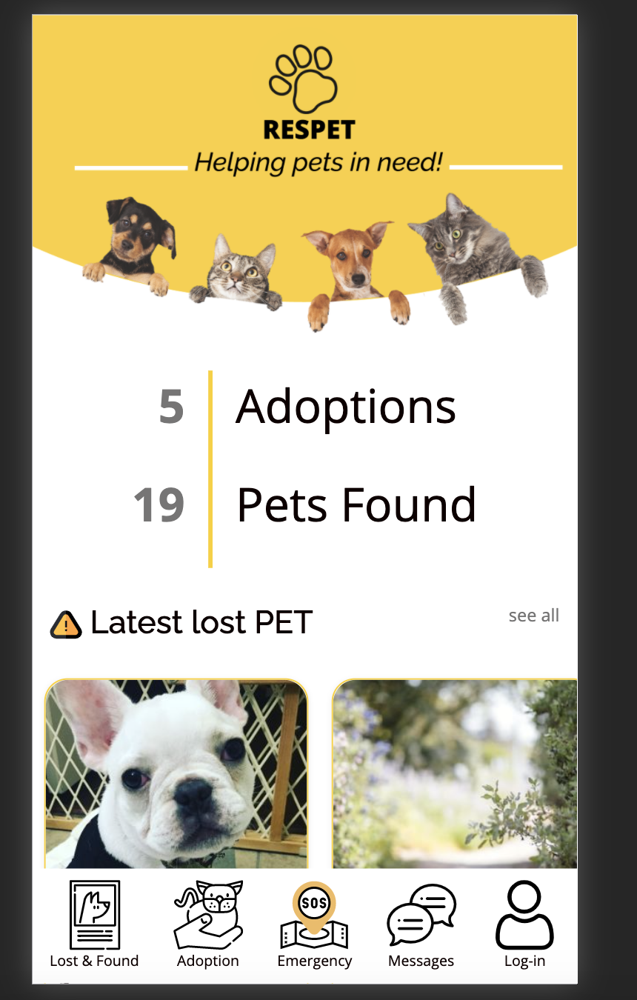
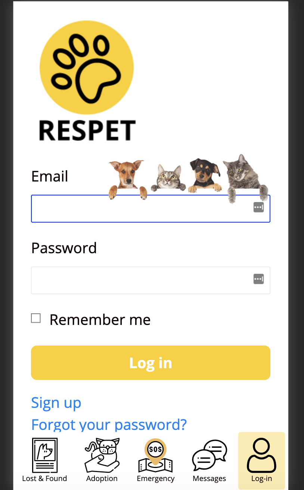
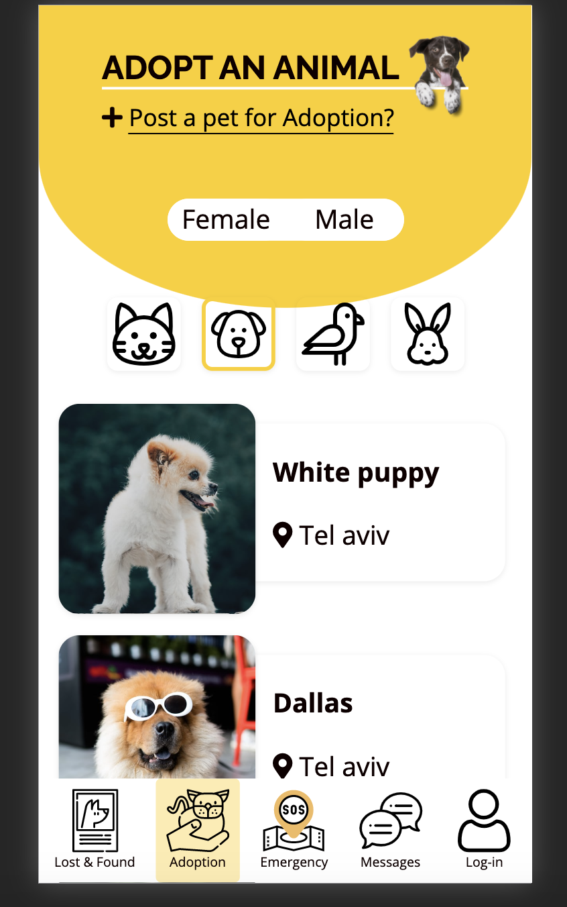
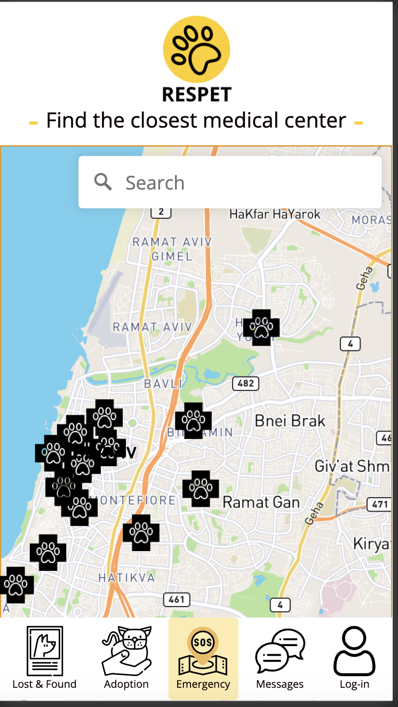

# Respet

    

Respet is web application for animals in need.

View it live: (https://http://www.respet.online//)

 

  

This was our final project for Le Wagon's 9-week Full-stack coding Bootcamp batch 342 in Tel Aviv.

# Technology Used

# Our team
    Angel Shamieh

    Charlotte Lui

    Talia Wolf

